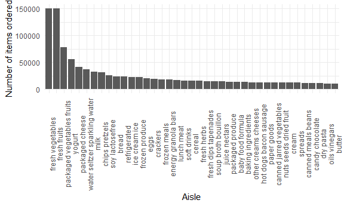
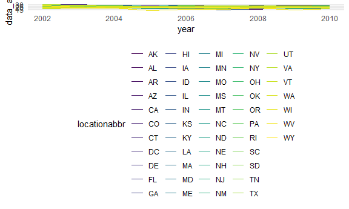
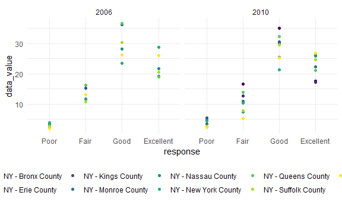

Homework 3
================
Rose Killian

### Loading libraries and data

``` r
library(tidyverse)
library(ggridges)
library(viridis)

knitr::opts_chunk$set(
  fig.width = 6,
  fig.asp = .6,
  out.width = "90%"
)

theme_set(theme_minimal() + theme(legend.position = "bottom"))

options(
  ggplot2.continuous.colour = "viridis",
  ggplot2.continuous.fill = "viridis"
)

scale_colour_discrete = scale_colour_viridis_d
scale_fill_discrete = scale_fill_viridis_d

library(p8105.datasets)
```

# Problem 1

``` r
data("instacart")
```

The Instacart dataset contains nearly 1.4 million observations of items
ordered from Instacart by individuals in New York City in 2017.

-   How many aisles are there. and which aisles are the most items
    ordered from?

``` r
instacart %>% 
  group_by(aisle) %>% 
  summarize(n_obs = n()) %>% 
  arrange(desc(n_obs))
```

    ## # A tibble: 134 x 2
    ##    aisle                          n_obs
    ##    <chr>                          <int>
    ##  1 fresh vegetables              150609
    ##  2 fresh fruits                  150473
    ##  3 packaged vegetables fruits     78493
    ##  4 yogurt                         55240
    ##  5 packaged cheese                41699
    ##  6 water seltzer sparkling water  36617
    ##  7 milk                           32644
    ##  8 chips pretzels                 31269
    ##  9 soy lactosefree                26240
    ## 10 bread                          23635
    ## # ... with 124 more rows

There are 134 aisles.The top 3 aisles ordered from are fresh vegetables,
fresh fruits, and packaged vegetables.

-   Make a plot that shows the number of items ordered in each aisle,
    limiting this to aisles with more than 10000 items ordered. Arrange
    aisles sensibly, and organize your plot so others can read it.

``` r
instacart %>% 
  group_by(aisle) %>% 
  summarize(n_obs = n()) %>% 
  filter(n_obs > 10000) %>% 
  ggplot(aes(x = reorder(aisle, -n_obs), y = n_obs)) +
  geom_col() + 
  theme(axis.text.x = element_text(angle = 90)) +
  labs(
    x = "Aisle",
    y = "Number of items ordered"
  )
```



Fresh vegetables and fresh fruits have the most items ordered by far
with each category having almost twice the number of items ordered as
the third highest, packaged vegetables and fruits, has.

-   Make a table showing the three most popular items in each of the
    aisles “baking ingredients”, “dog food care”, and “packaged
    vegetables fruits”. Include the number of times each item is ordered
    in your table.

``` r
instacart %>% 
  filter(aisle %in% c("baking ingredients", "dog food care", "packaged vegetables fruits")) %>%
  group_by(aisle) %>%
  summarize(
    product_max = max(product_name),
    n_obs = n()
  ) %>% 
  knitr::kable()
```

| aisle                      | product\_max                    | n\_obs |
|:---------------------------|:--------------------------------|-------:|
| baking ingredients         | Zero Calorie Sweetener          |  13088 |
| dog food care              | Zero Grain Turkey Dog Food      |   1612 |
| packaged vegetables fruits | Zucchini Squash, Baby Courgette |  78493 |

This is not what I want. How do I get top 3 per group????

-   Make a table showing the mean hour of the day at which Pink Lady
    Apples and Coffee Ice Cream are ordered on each day of the week;
    format this table for human readers (i.e. produce a 2 x 7 table).

``` r
instacart %>% 
  filter(product_name %in% c("Pink Lady Apples", "Coffee Ice Cream")) %>% 
  group_by(product_name, order_dow) %>% 
  mutate(mean_hod = round(mean(order_hour_of_day))) %>%
  group_by(product_name) %>% 
  select(product_name, order_dow, mean_hod) %>% 
  distinct() %>%
  pivot_wider(
    names_from = "order_dow",
    values_from = "mean_hod"
  ) %>% 
  relocate(product_name, `0`, `1`, `2`, `3`, `4`, `5`, `6`) %>% 
  rename("Sunday" = `0`, "Monday" = `1`, "Tuesday" = `2`, "Wednesday" = `3`, "Thursday" = `4`, "Friday" = `5`, "Saturday" = `6`) %>% 
  knitr::kable()
```

| product\_name    | Sunday | Monday | Tuesday | Wednesday | Thursday | Friday | Saturday |
|:-----------------|-------:|-------:|--------:|----------:|---------:|-------:|---------:|
| Pink Lady Apples |     13 |     11 |      12 |        14 |       12 |     13 |       12 |
| Coffee Ice Cream |     14 |     14 |      15 |        15 |       15 |     12 |       14 |

*needs comment*

# Problem 2

``` r
data("brfss_smart2010")
```

First, some data cleaning:

``` r
brfss = 
brfss_smart2010 %>% 
  janitor::clean_names() %>% 
  filter(topic == "Overall Health",
         response %in% c("Poor", "Fair", "Good", "Very Good", "Excellent")) %>% 
  mutate(response = factor(response, c("Poor", "Fair", "Good", "Very Good", "Excellent")))
```

-   In 2002, which states were observed at 7 or more locations? What
    about in 2010?

``` r
brfss %>%
  filter(year == "2002") %>% 
  group_by(locationabbr) %>% 
  summarise(n_obs = n()) %>% 
  mutate(locations = n_obs / 4) %>% 
  filter(locations > 6)
```

    ## # A tibble: 6 x 3
    ##   locationabbr n_obs locations
    ##   <chr>        <int>     <dbl>
    ## 1 CT              28         7
    ## 2 FL              28         7
    ## 3 MA              32         8
    ## 4 NC              28         7
    ## 5 NJ              32         8
    ## 6 PA              40        10

``` r
brfss %>%
  filter(year == "2010") %>% 
  group_by(locationabbr) %>% 
  summarise(n_obs = n()) %>% 
  mutate(locations = n_obs / 4) %>% 
  filter(locations > 6)
```

    ## # A tibble: 14 x 3
    ##    locationabbr n_obs locations
    ##    <chr>        <int>     <dbl>
    ##  1 CA              48        12
    ##  2 CO              28         7
    ##  3 FL             164        41
    ##  4 MA              36         9
    ##  5 MD              48        12
    ##  6 NC              48        12
    ##  7 NE              40        10
    ##  8 NJ              76        19
    ##  9 NY              36         9
    ## 10 OH              32         8
    ## 11 PA              28         7
    ## 12 SC              28         7
    ## 13 TX              64        16
    ## 14 WA              40        10

In 2002, 6 states had 7 or more observation locations: CT, FL, MA, NC,
NJ, and PA.

In 2010, 14 states had 7 or more observation locations: CA, CO, FL, MA,
MD, NC, NE, NJ, NY, OH, PA, SC, TX, and WA.

-   Construct a dataset that is limited to Excellent responses, and
    contains, year, state, and a variable that averages the data\_value
    across locations within a state. Make a “spaghetti” plot of this
    average value over time within a state (that is, make a plot showing
    a line for each state across years – the geom\_line geometry and
    group aesthetic will help).

``` r
brfss %>% 
  select(year, locationabbr, response, data_value, geo_location) %>% 
  filter(response == "Excellent") %>% 
  group_by(locationabbr, year) %>% 
  mutate(data_avg = mean(data_value)) %>% 
  select(year, locationabbr, data_avg) %>% 
  ggplot(aes(x = year, y = data_avg, color = locationabbr)) +
  geom_line() +
  theme(legend.position = "right")
```

    ## Warning: Removed 65 row(s) containing missing values (geom_path).



*needs comment*

-   Make a two-panel plot showing, for the years 2006, and 2010,
    distribution of data\_value for responses (“Poor” to “Excellent”)
    among locations in NY State.

``` r
brfss %>% 
  filter(locationabbr == "NY", year %in% c("2006", "2010")) %>% 
  group_by(year, locationdesc) %>% 
  ggplot(aes(x = response, y = data_value, color = locationdesc)) +
  geom_point() +
  facet_grid(. ~ year)
```



The overall `data_value` range of each response type is fairly
consistent across 2006 and 2010. The range of values for fair responses
is wider in 2010 and the max `data_value` is highest in 2006 among the
good responses.

# Problem 3

Import and tidy data:

``` r
accel_df = 
  read_csv("data/accel_data.csv") %>% 
  janitor::clean_names() %>% 
  mutate(
    weekday = recode(day, "Sunday" = 0, "Saturday" = 0, "Monday" = 1, "Tuesday" = 1, "Wednesday" = 1, "Thursday" = 1, "Friday" = 1)) %>% 
  pivot_longer(
    activity_1:activity_1440,
    names_to = "minute",
    names_prefix = "activity_",
    values_to = "activity"
  )
```

    ## Rows: 35 Columns: 1443

    ## -- Column specification --------------------------------------------------------
    ## Delimiter: ","
    ## chr    (1): day
    ## dbl (1442): week, day_id, activity.1, activity.2, activity.3, activity.4, ac...

    ## 
    ## i Use `spec()` to retrieve the full column specification for this data.
    ## i Specify the column types or set `show_col_types = FALSE` to quiet this message.

The data set `accel_df` contains 50400 observations of accelerometer
data from a 63 year-old male collected every minute over 5 weeks. The
variable `week` denotes what week from 1 to 5 the observation is from,
`day_id` denotes the day since start of the study, `day` indicates the
day of the week, `weekday` indicates if the day was a weekday or not (1
for weekday, 0 for weekend), `minute` indicates the minute of the day
the observation occurs, starting at midnight, and `activity` is the
activity count for each observation.

-   Traditional analyses of accelerometer data focus on the total
    activity over the day. Using your tidied dataset, aggregate across
    minutes to create a total activity variable for each day, and create
    a table showing these totals. Are any trends apparent?

``` r
accel_df %>% 
  group_by(day_id) %>% 
  mutate(tot_activity = sum(activity)) %>% 
  select(day_id, day, tot_activity) %>% 
  distinct() %>% 
  knitr::kable()
```

| day\_id | day       | tot\_activity |
|--------:|:----------|--------------:|
|       1 | Friday    |     480542.62 |
|       2 | Monday    |      78828.07 |
|       3 | Saturday  |     376254.00 |
|       4 | Sunday    |     631105.00 |
|       5 | Thursday  |     355923.64 |
|       6 | Tuesday   |     307094.24 |
|       7 | Wednesday |     340115.01 |
|       8 | Friday    |     568839.00 |
|       9 | Monday    |     295431.00 |
|      10 | Saturday  |     607175.00 |
|      11 | Sunday    |     422018.00 |
|      12 | Thursday  |     474048.00 |
|      13 | Tuesday   |     423245.00 |
|      14 | Wednesday |     440962.00 |
|      15 | Friday    |     467420.00 |
|      16 | Monday    |     685910.00 |
|      17 | Saturday  |     382928.00 |
|      18 | Sunday    |     467052.00 |
|      19 | Thursday  |     371230.00 |
|      20 | Tuesday   |     381507.00 |
|      21 | Wednesday |     468869.00 |
|      22 | Friday    |     154049.00 |
|      23 | Monday    |     409450.00 |
|      24 | Saturday  |       1440.00 |
|      25 | Sunday    |     260617.00 |
|      26 | Thursday  |     340291.00 |
|      27 | Tuesday   |     319568.00 |
|      28 | Wednesday |     434460.00 |
|      29 | Friday    |     620860.00 |
|      30 | Monday    |     389080.00 |
|      31 | Saturday  |       1440.00 |
|      32 | Sunday    |     138421.00 |
|      33 | Thursday  |     549658.00 |
|      34 | Tuesday   |     367824.00 |
|      35 | Wednesday |     445366.00 |

I don’t really see any trends here.

-   Accelerometer data allows the inspection activity over the course of
    the day. Make a single-panel plot that shows the 24-hour activity
    time courses for each day and use color to indicate day of the week.
    Describe in words any patterns or conclusions you can make based on
    this graph.

``` r
accel_df %>% 
  group_by(day_id) %>% 
  ggplot(aes(x = minute, y = activity, color = day)) +
  geom_point(alpha = .8) +
  theme(axis.text.x = element_text(angle = 90))
```


The x-axis is a mess and I do not know why.
