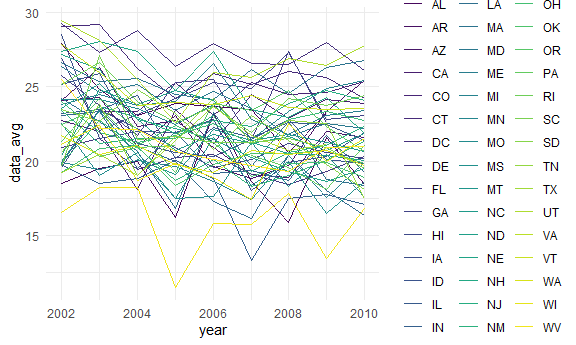
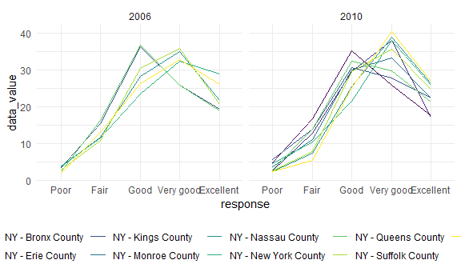
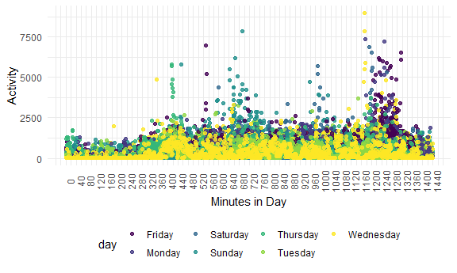

Homework 3
================
Rose Killian

### Loading libraries and data

``` r
library(tidyverse)

knitr::opts_chunk$set(
  fig.width = 6,
  fig.asp = .6,
  out.width = "90%"
)

theme_set(theme_minimal() + theme(legend.position = "bottom"))

options(
  ggplot2.continuous.colour = "viridis",
  ggplot2.continuous.fill = "viridis"
)

scale_colour_discrete = scale_colour_viridis_d
scale_fill_discrete = scale_fill_viridis_d

library(p8105.datasets)
```

# Problem 1

``` r
data("instacart")
```

The Instacart dataset contains nearly 1.4 million observations of items
ordered from Instacart by individuals in New York City in 2017 and has
15 variables including the order ID number (`order_id`), the ID of the
customer making the order (`user_id`), how many orders that customer has
made (`order_number`), and how many days it has been since their last
order (`days_since_prior_order`). For example, the first order in the
dataset was ordered by user 112108 and it was their 4th order. They
placed the order at 10 AM and it had been 9 days since their last order.
They ordered the following items: c(“Bulgarian Yogurt”, “Organic 4% Milk
Fat Whole Milk Cottage Cheese”, “Organic Celery Hearts”, “Cucumber
Kirby”, “Lightly Smoked Sardines in Olive Oil”, “Bag of Organic
Bananas”, “Organic Hass Avocado”, “Organic Whole String Cheese”).

### Number of aisles and popularity

-   How many aisles are there. Which aisles are the most items ordered
    from?

``` r
instacart %>% 
  group_by(aisle) %>% 
  summarize(n_obs = n()) %>% 
  arrange(desc(n_obs))
```

    ## # A tibble: 134 x 2
    ##    aisle                          n_obs
    ##    <chr>                          <int>
    ##  1 fresh vegetables              150609
    ##  2 fresh fruits                  150473
    ##  3 packaged vegetables fruits     78493
    ##  4 yogurt                         55240
    ##  5 packaged cheese                41699
    ##  6 water seltzer sparkling water  36617
    ##  7 milk                           32644
    ##  8 chips pretzels                 31269
    ##  9 soy lactosefree                26240
    ## 10 bread                          23635
    ## # ... with 124 more rows

There are 134 aisles.The top 3 aisles ordered from are fresh vegetables,
fresh fruits, and packaged vegetables.

### Plot of aisles with more than 10K items ordered

-   Make a plot that shows the number of items ordered in each aisle,
    limiting this to aisles with more than 10000 items ordered.

``` r
instacart %>% 
  group_by(aisle) %>% 
  summarize(n_obs = n()) %>% 
  filter(n_obs > 10000) %>% 
  ggplot(aes(x = reorder(aisle, -n_obs), y = n_obs)) +
  geom_col() + 
  theme(axis.text.x = element_text(angle = 90)) +
  labs(
    x = "Aisle",
    y = "Number of items ordered"
  )
```


Fresh vegetables and fresh fruits have the most items ordered by far
with each category having almost twice the number of items ordered as
the third highest, packaged vegetables and fruits, has.

### Top 3 Table

-   Make a table showing the three most popular items in each of the
    aisles “baking ingredients”, “dog food care”, and “packaged
    vegetables fruits”.

``` r
instacart %>% 
  filter(aisle %in% c("baking ingredients", "dog food care", "packaged vegetables fruits")) %>%
  select(aisle, product_name) %>% 
  group_by(aisle, product_name) %>%
  summarize(n_obs = n()) %>% 
  arrange(desc(n_obs)) %>% 
  slice(1:3) %>% 
  knitr::kable()
```

    ## `summarise()` has grouped output by 'aisle'. You can override using the `.groups` argument.

| aisle                      | product\_name                                 | n\_obs |
|:---------------------------|:----------------------------------------------|-------:|
| baking ingredients         | Light Brown Sugar                             |    499 |
| baking ingredients         | Pure Baking Soda                              |    387 |
| baking ingredients         | Cane Sugar                                    |    336 |
| dog food care              | Snack Sticks Chicken & Rice Recipe Dog Treats |     30 |
| dog food care              | Organix Chicken & Brown Rice Recipe           |     28 |
| dog food care              | Small Dog Biscuits                            |     26 |
| packaged vegetables fruits | Organic Baby Spinach                          |   9784 |
| packaged vegetables fruits | Organic Raspberries                           |   5546 |
| packaged vegetables fruits | Organic Blueberries                           |   4966 |

The three most popular baking items are light brown sugar, pure baking
soda, and cane sugar. The most popular dog food items are are chicken
and rice dog treats, organix chicken and brown rice dog food, and small
dog biscuits. The most popular packaged vegetable and fruit items are
baby spinach, and organic raspberries and blueberries *(those last 3
sound like the start of a nice salad!)*

### Apples and Ice cream

-   Make a table showing the mean hour of the day at which Pink Lady
    Apples and Coffee Ice Cream are ordered on each day of the week.

``` r
instacart %>% 
  filter(product_name %in% c("Pink Lady Apples", "Coffee Ice Cream")) %>% 
  group_by(product_name, order_dow) %>% 
  mutate(mean_hod = round(mean(order_hour_of_day))) %>%
  group_by(product_name) %>% 
  select(product_name, order_dow, mean_hod) %>% 
  distinct() %>%
  pivot_wider(
    names_from = "order_dow",
    values_from = "mean_hod"
  ) %>% 
  relocate(product_name, `0`, `1`, `2`, `3`, `4`, `5`, `6`) %>% 
  rename("Sunday" = `0`, "Monday" = `1`, "Tuesday" = `2`, "Wednesday" = `3`, "Thursday" = `4`, "Friday" = `5`, "Saturday" = `6`) %>% 
  knitr::kable()
```

| product\_name    | Sunday | Monday | Tuesday | Wednesday | Thursday | Friday | Saturday |
|:-----------------|-------:|-------:|--------:|----------:|---------:|-------:|---------:|
| Pink Lady Apples |     13 |     11 |      12 |        14 |       12 |     13 |       12 |
| Coffee Ice Cream |     14 |     14 |      15 |        15 |       15 |     12 |       14 |

Customers tend to order the apples in the morning or early afternoon,
between 11 AM and 2 PM. They tend to order the ice cream in the
afternoon, between 2 PM and 3 PM.

# Problem 2

``` r
data("brfss_smart2010")
```

First, some data cleaning:

``` r
brfss = 
brfss_smart2010 %>% 
  janitor::clean_names() %>% 
  filter(topic == "Overall Health",
         response %in% c("Poor", "Fair", "Good", "Very good", "Excellent")) %>% 
  mutate(response = factor(response, c("Poor", "Fair", "Good", "Very good", "Excellent")))
```

### 7+ Locations

-   In 2002, which states were observed at 7 or more locations? What
    about in 2010?

``` r
brfss %>%
  filter(year == "2002") %>% 
  group_by(locationabbr) %>% 
  summarise(n_obs = n()) %>% 
  mutate(locations = n_obs / 5) %>% 
  filter(locations > 6)
```

    ## # A tibble: 6 x 3
    ##   locationabbr n_obs locations
    ##   <chr>        <int>     <dbl>
    ## 1 CT              35         7
    ## 2 FL              35         7
    ## 3 MA              40         8
    ## 4 NC              35         7
    ## 5 NJ              40         8
    ## 6 PA              50        10

``` r
brfss %>%
  filter(year == "2010") %>% 
  group_by(locationabbr) %>% 
  summarise(n_obs = n()) %>% 
  mutate(locations = n_obs / 5) %>% 
  filter(locations > 6)
```

    ## # A tibble: 14 x 3
    ##    locationabbr n_obs locations
    ##    <chr>        <int>     <dbl>
    ##  1 CA              60        12
    ##  2 CO              35         7
    ##  3 FL             205        41
    ##  4 MA              45         9
    ##  5 MD              60        12
    ##  6 NC              60        12
    ##  7 NE              50        10
    ##  8 NJ              95        19
    ##  9 NY              45         9
    ## 10 OH              40         8
    ## 11 PA              35         7
    ## 12 SC              35         7
    ## 13 TX              80        16
    ## 14 WA              50        10

In 2002, 6 states had 7 or more observation locations: CT, FL, MA, NC,
NJ, and PA.

In 2010, 14 states had 7 or more observation locations: CA, CO, FL, MA,
MD, NC, NE, NJ, NY, OH, PA, SC, TX, and WA.

### Spaghetti Plot

-   Construct a dataset that is limited to Excellent responses, and
    contains, year, state, and a variable that averages the data\_value
    across locations within a state. Make a “spaghetti” plot of this
    average value over time within a state.

``` r
brfss %>% 
  select(year, locationabbr, response, data_value, geo_location) %>% 
  filter(response == "Excellent") %>% 
  group_by(locationabbr, year) %>% 
  mutate(data_avg = mean(data_value)) %>% 
  select(year, locationabbr, data_avg) %>% 
  ggplot(aes(x = year, y = data_avg, group = locationabbr, color = locationabbr)) +
  geom_line() +
  theme(legend.position = "right")
```

    ## Warning: Removed 65 row(s) containing missing values (geom_path).



The `data_avg` value for “Excellent” responses seems to vary widely
across years even within the same state.

### NY 2006 vs 2010

-   Make a two-panel plot showing, for the years 2006, and 2010,
    distribution of data\_value for responses (“Poor” to “Excellent”)
    among locations in NY State.

``` r
brfss %>% 
  filter(locationabbr == "NY", year %in% c("2006", "2010")) %>% 
  group_by(year, locationdesc) %>% 
  ggplot(aes(x = response, y = data_value, group = locationdesc, color = locationdesc)) +
  geom_line() +
  facet_grid(. ~ year)
```



The overall `data_value` range of each response type is fairly
consistent across 2006 and 2010. The range of values for fair responses
is wider in 2010 and the max `data_value` is highest in 2010 among the
“Very good” responses. The survey looked at more counties in 2010 than
in 2006.

# Problem 3

Import and tidy data:

``` r
accel_df = 
  read_csv("data/accel_data.csv") %>% 
  janitor::clean_names() %>% 
  mutate(
    weekday = recode(day, "Sunday" = 0, "Saturday" = 0, "Monday" = 1, "Tuesday" = 1, "Wednesday" = 1, "Thursday" = 1, "Friday" = 1)) %>% 
  pivot_longer(
    activity_1:activity_1440,
    names_to = "minute",
    names_prefix = "activity_",
    values_to = "activity"
  )
```

    ## Rows: 35 Columns: 1443

    ## -- Column specification --------------------------------------------------------
    ## Delimiter: ","
    ## chr    (1): day
    ## dbl (1442): week, day_id, activity.1, activity.2, activity.3, activity.4, ac...

    ## 
    ## i Use `spec()` to retrieve the full column specification for this data.
    ## i Specify the column types or set `show_col_types = FALSE` to quiet this message.

The data set `accel_df` contains 50400 observations of accelerometer
data from a 63 year-old male collected every minute over 5 weeks. The
variable `week` denotes what week from 1 to 5 the observation is from,
`day_id` denotes the day since start of the study, `day` indicates the
day of the week, `weekday` indicates if the day was a weekday or not (1
for weekday, 0 for weekend), `minute` indicates the minute of the day
the observation occurs, starting at midnight, and `activity` is the
activity count for each observation.

### Trends?

-   Traditional analyses of accelerometer data focus on the total
    activity over the day. Using your tidied dataset, aggregate across
    minutes to create a total activity variable for each day, and create
    a table showing these totals. Are any trends apparent?

``` r
accel_df %>% 
  group_by(day_id) %>% 
  mutate(tot_activity = sum(activity)) %>% 
  select(day_id, day, tot_activity) %>% 
  distinct() %>% 
  knitr::kable()
```

| day\_id | day       | tot\_activity |
|--------:|:----------|--------------:|
|       1 | Friday    |     480542.62 |
|       2 | Monday    |      78828.07 |
|       3 | Saturday  |     376254.00 |
|       4 | Sunday    |     631105.00 |
|       5 | Thursday  |     355923.64 |
|       6 | Tuesday   |     307094.24 |
|       7 | Wednesday |     340115.01 |
|       8 | Friday    |     568839.00 |
|       9 | Monday    |     295431.00 |
|      10 | Saturday  |     607175.00 |
|      11 | Sunday    |     422018.00 |
|      12 | Thursday  |     474048.00 |
|      13 | Tuesday   |     423245.00 |
|      14 | Wednesday |     440962.00 |
|      15 | Friday    |     467420.00 |
|      16 | Monday    |     685910.00 |
|      17 | Saturday  |     382928.00 |
|      18 | Sunday    |     467052.00 |
|      19 | Thursday  |     371230.00 |
|      20 | Tuesday   |     381507.00 |
|      21 | Wednesday |     468869.00 |
|      22 | Friday    |     154049.00 |
|      23 | Monday    |     409450.00 |
|      24 | Saturday  |       1440.00 |
|      25 | Sunday    |     260617.00 |
|      26 | Thursday  |     340291.00 |
|      27 | Tuesday   |     319568.00 |
|      28 | Wednesday |     434460.00 |
|      29 | Friday    |     620860.00 |
|      30 | Monday    |     389080.00 |
|      31 | Saturday  |       1440.00 |
|      32 | Sunday    |     138421.00 |
|      33 | Thursday  |     549658.00 |
|      34 | Tuesday   |     367824.00 |
|      35 | Wednesday |     445366.00 |

``` r
accel_df %>% 
  group_by(day) %>% 
  summarise(daily_act = sum(activity)) %>% 
  mutate(day = factor(day, c("Sunday", "Monday", "Tuesday", "Wednesday", "Thursday", "Friday", "Saturday"))) %>% 
  arrange(day) %>% 
  knitr::kable()
```

| day       | daily\_act |
|:----------|-----------:|
| Sunday    |    1919213 |
| Monday    |    1858699 |
| Tuesday   |    1799238 |
| Wednesday |    2129772 |
| Thursday  |    2091151 |
| Friday    |    2291711 |
| Saturday  |    1369237 |

Looking at each individual day (via `day_id`) I do not see any
particular trends. The activity count for day 24 and day 31 are both
1440, the minimum value. These are both Saturdays and I suspect the
participant did not wear the accelerometer these days. If I instead look
at the days aggregated by day of the week, it appears that more activity
occurs in the latter half of the week. Wednesday through Friday have
higher daily activity than Sunday through Tuesday do.

### Activity over 24 hours

-   Accelerometer data allows the inspection activity over the course of
    the day. Make a single-panel plot that shows the 24-hour activity
    time courses for each day and use color to indicate day of the week.

``` r
accel_df %>% 
  group_by(day_id) %>% 
  ggplot(aes(x = as.numeric(minute), y = activity, color = day)) +
  geom_point(alpha = .8) +
  theme(axis.text.x = element_text(angle = 90)) +
  scale_x_continuous(breaks = seq(0, 1440, by = 40)) +
   labs(
    x = "Minutes in Day",
    y = "Activity"
  )
```



There is relatively little activity early in the day before about 5 AM.
This makes sense as from midnight to around 5 is when most people would
be sleeping. It looks like most days this individual wakes up around 6
AM. For most observations the activity level stayed below 2500; however,
this individual seems to have been more active on Sunday and Thursday
early in the day before 12 PM and on Friday and Monday in the late
evening around 9 PM. He was also more active late at night on
Wednesdays.
